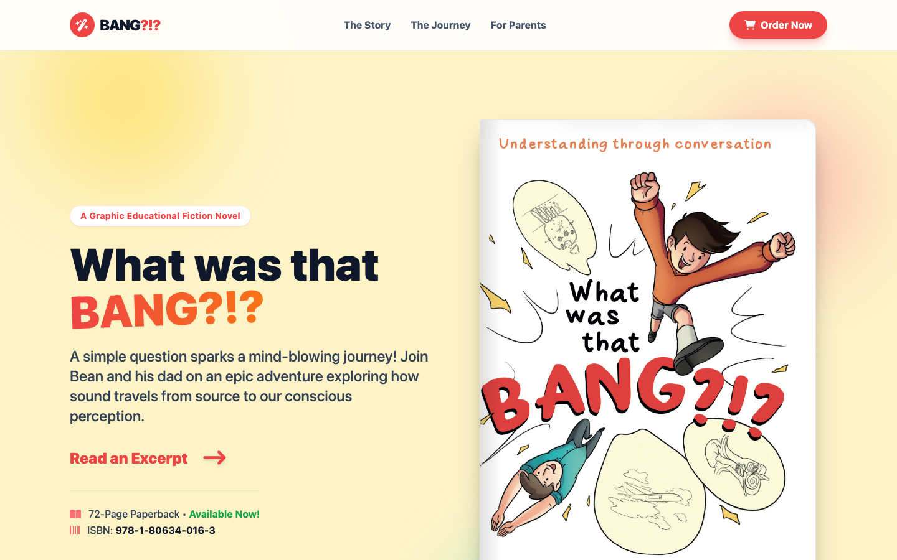

# What was that BANG?!? — book site

Marketing site for my children's science book *What was that BANG?!?* (Troubador, 2026). Designed and built end-to-end.

**Live:** [jamesbrownebooks.com](https://jamesbrownebooks.com/)

A single HTML file — no build step, no framework. The centrepiece is a hand-rolled 3D book preview that flips through real pages: per-sheet z-index management to prevent 3D clipping, mobile/desktop transform-scaling so the open spread fits any viewport, CSS-only spine shadows for depth. Tailwind via CDN, Font Awesome for icons, ~100 lines of vanilla JS for the flipper.

## About the book

72-page illustrated science book for ages 8–12. A 9-year-old asks his dad what made the bang. They shrink down and travel through the ear → cochlea → neurons → brain to figure out how sound becomes perception. Built around Socratic dialogue — the dad asks questions, the child reasons through them, instead of being lectured at.

ISBN 978-1-80634-016-3 · [Buy direct](https://buy.stripe.com/eVq8wQ86ibZkafLd0bao800) · [Amazon UK](https://www.amazon.co.uk/What-was-that-Bang-Understanding/dp/180634016X/)
